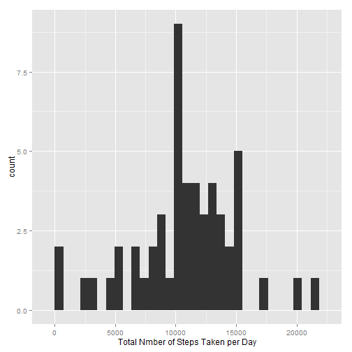
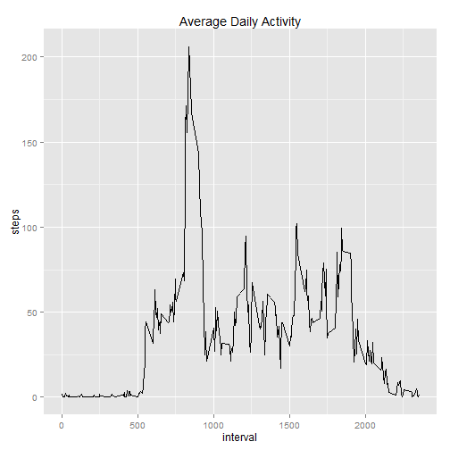
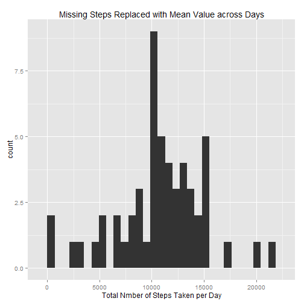
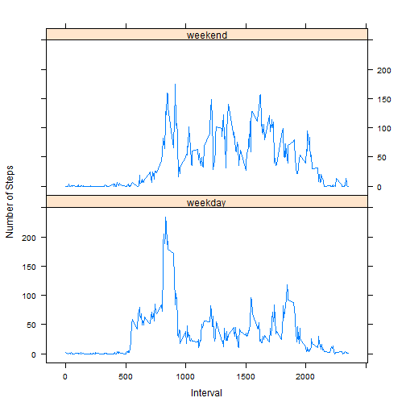

Reproducible Research Assignment 1
==================================

# Loading and Preprocessing the Data
The data for this assignment can be downloaded from the course web site: [Activity monitoring data](https://d396qusza40orc.cloudfront.net/repdata%2Fdata%2Factivity.zip). It contains from a personal activity monitoring device which collects data at 5 minute intervals through out the day. The data consists of two months of data from an anonymous individual collected during the months of October and November, 2012 and include the number of steps taken in 5 minute intervals each day.

Once downloaded, the data is unzipped into `activity.csv` file. In the following R code, I assume this file resides in the current working directory.


```r
activity <- read.csv("activity.csv")
str(activity)
```

```
## 'data.frame':	17568 obs. of  3 variables:
##  $ steps   : int  NA NA NA NA NA NA NA NA NA NA ...
##  $ date    : Factor w/ 61 levels "2012-10-01","2012-10-02",..: 1 1 1 1 1 1 1 1 1 1 ...
##  $ interval: int  0 5 10 15 20 25 30 35 40 45 ...
```

```r
activity$time <- strptime(as.character(activity$date), "%Y-%m-%d")
summary(data)
```

```
##      steps            date                        interval   
##  Min.   :  0.0   Min.   :2012-10-01 00:00:00   Min.   :   0  
##  1st Qu.:  0.0   1st Qu.:2012-10-16 00:00:00   1st Qu.: 589  
##  Median :  0.0   Median :2012-10-31 00:00:00   Median :1178  
##  Mean   : 37.4   Mean   :2012-10-31 00:25:34   Mean   :1178  
##  3rd Qu.: 12.0   3rd Qu.:2012-11-15 00:00:00   3rd Qu.:1766  
##  Max.   :806.0   Max.   :2012-11-30 00:00:00   Max.   :2355  
##  NA's   :2304
```


# Mean Total Number of Steps Taken per Day

We make a histogram for the total number of steps taken per day. Here, I assume ggplot2 is installed.


```r
x1 <- aggregate(steps ~ date, data = activity, FUN = sum)
summary(x1)
```

```
##          date        steps      
##  2012-10-02: 1   Min.   :   41  
##  2012-10-03: 1   1st Qu.: 8841  
##  2012-10-04: 1   Median :10765  
##  2012-10-05: 1   Mean   :10766  
##  2012-10-06: 1   3rd Qu.:13294  
##  2012-10-07: 1   Max.   :21194  
##  (Other)   :47
```

```r
library(ggplot2)
qplot(x1$steps, xlab = "Total Nmber of Steps Taken per Day")
```

```
## stat_bin: binwidth defaulted to range/30. Use 'binwidth = x' to adjust this.
```

 


As shown in the summary above, the mean of this daily total number is 1.0766 &times; 10<sup>4</sup> and the median is 10765.

# Average Daily Activity Pattern

We plot the number of steps taken per 5-minute interval, averaged across all days.


```r
x2 <- aggregate(steps ~ interval, data = activity, FUN = mean)
ggplot(data = x2, aes(x = interval, y = steps, group = 1)) + geom_line() + ggtitle("Average Daily Activity")
```

 


The interval contains the maximum number of steps can be obtained as follows:

```r
x2$interval[which(x2$steps == max(x2$steps))]
```

```
## [1] 835
```


# Imputing Missing Values

This data contains missing values. The number of observations (rows) containing missing value is:

```r
sum(with(activity, is.na(steps) | is.na(date) | is.na(interval)))
```

```
## [1] 2304
```

Indeed, only `steps` has NA values:

```r
sum(with(activity, is.na(steps)))
```

```
## [1] 2304
```


Now we impute missing steps using the mean for the same interval across all days. Then get the total number of steps per day on this new data.

```r
activity2 <- data.frame(steps = activity$steps, date = activity$date, interval = activity$interval, 
    time = activity$time)
condition <- is.na(activity2$steps)
activity2$steps[condition] = x2$steps[condition]
x3 <- aggregate(steps ~ date, data = activity2, FUN = sum)
summary(x3)
```

```
##          date        steps      
##  2012-10-01: 1   Min.   :   41  
##  2012-10-02: 1   1st Qu.: 8860  
##  2012-10-03: 1   Median :10766  
##  2012-10-04: 1   Mean   :10766  
##  2012-10-05: 1   3rd Qu.:13191  
##  2012-10-06: 1   Max.   :21194  
##  (Other)   :48
```


We now plot the total number of steps per day using this new data.

```r
qplot(x3$steps, xlab = "Total Nmber of Steps Taken per Day", main = "Missing Steps Replaced with Mean Value across Days")
```

```
## stat_bin: binwidth defaulted to range/30. Use 'binwidth = x' to adjust this.
```

 


In addition, as shown in the summary above, the mean of this daily total number is 1.0766 &times; 10<sup>4</sup> and the median is 1.0766 &times; 10<sup>4</sup>. These values hardly changed due to the fact that we used the mean value to replace the missing values.

# Difference between Weekdays and Weekends

We add a new column to indicate whether a given date is a weekday or weekend:

```r
activity$dateType <- as.factor(ifelse(weekdays(activity$time, TRUE) %in% c("Sat", 
    "Sun"), "weekend", "weekday"))
```


Now we plot average number of steps on weekends vs. weekdays. I assume the lattice package is already installed.

```r
x4 <- aggregate(steps ~ interval + dateType, data = activity, FUN = mean)
library(lattice)
xyplot(steps ~ interval | dateType, x4, type = "l", xlab = "Interval", ylab = "Number of Steps", 
    layout = c(1, 2))
```

 


<!-- Call the following from R to produce the HTML
knit2html('PA1_template.rmd')
-->

